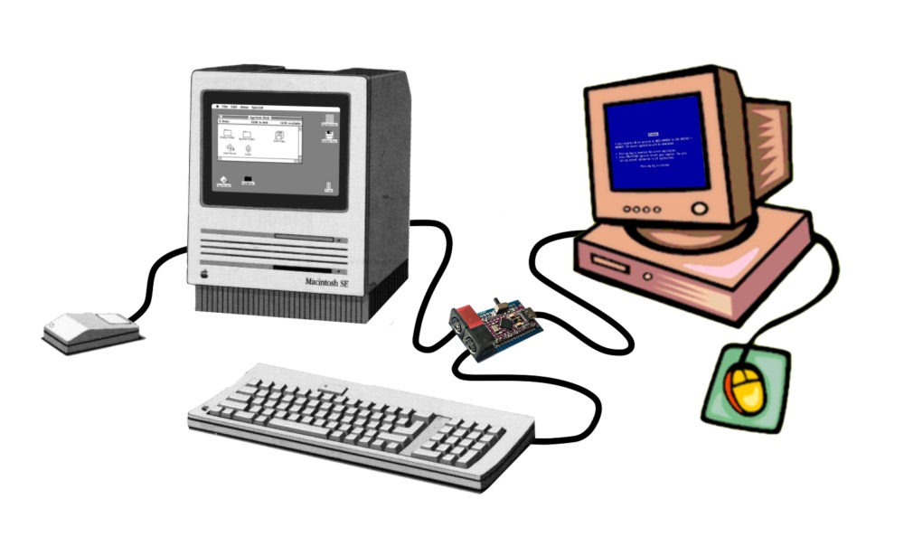

#  ADB to USB converter for Apple keyboards

Allow one ADB keyboard to be used on one ADB computer (old Macintosh and Apple IIgs) and one USB computer at the same time by switching between them.



## What works

- adb passthrough between a macintosh and keyboard/mouse
- adb keyboard to usb-hid conversion:
  - iso and ansi layouts
  - locking caps lock
  - power key in usb (translated as 0x66 "keyboard power")
- tested on multiple keyboards: aek ii, m0116/m0118, appledesign...
- tested on macintosh se
  
## What don't work yet

- power key shunt for macintosh ii soft power: i don't have the hardware to test it
- keyboard leds on usb: the *keyboard* library doesn't handle hid output reports
- hotplugging adb: works randomly, the microcontroller don't seems to like that
- mouse passthrough in usb-hid mode
- correct keyboard detection by the macintosh when the board is in usb mode: not a problem in practice
- collision detection handling: the program calls the keyboard at address 2

## Hardware needed

- arduino pro micro because it works on 5V and is hid capable
- a resistor (1K - 10K ohm) for the pull up
- 2 mini-din 4 pin connectors
- 2-pin switch

## How to build it

- connect the switch between A3 (PF4) and GND
- connect GND on the two mini-din pins 4
- connect 9 (PB5) to the mini-din A pin 1 (computer adb line)
- connect VCC to the mini-din B pin 3 (keyboard power)
- connect 10 (PB6) to the mini-din B pin 1 (keyboard adb line)
- connect 10 (PB6) to VCC through the resistor
- mark the mini-din B as the keyboard connector

> [!CAUTION]
> i don't know what happens if you invert the connectors and inject external 5V into the macintosh adb

Mini-DIN female connector front view :
```
/------\
| 4  3 |
| 2  1 |
\__==__/
```

Arduino Pro Micro pinout :
```
           ___________
PD3  TXD  |    USB    |  RAW
PD2   20  |           |  GND
     GND  |           |  RST
     GND  |           |  VCC
PD1    2  |           |  A3   PF4
PD0    3  |           |  A2   PF5
PD4    4  |           |  A1   PF6
PC6    5  |           |  A0   PF7
PD7    6  |           |  15   PB1
PE6    7  |           |  14   PB3
PB4    8  |           |  16   PB2
PB5    9  |___________|  10   PB6

```

## How to compile and upload it

1. install `arduino-cli`
2. `arduino-cli core install arduino:avr`
3. `arduino-cli lib install Keyboard`
4. compile this project by `cd` in then `arduino-cli compile --fqbn arduino:avr:micro`
5. connect the board to the computer
6. get board port with `arduino-cli board list`
7. upload it `arduino-cli upload -p /dev/.......`

## References

- [Guide to the Macintosh family hardware, Chapter 8 : Apple Desktop Bus, Apple, 1990](https://archive.org/details/apple-guide-macintosh-family-hardware/page/n325/mode/2up)
- [Apple Desktop Bus Protocol, lopaciuk.eu, 2021](https://www.lopaciuk.eu/2021/03/26/apple-adb-protocol.html)
- [Understanding the ADB Service Request Signal, bigmessowires, 2016](https://www.bigmessowires.com/2016/03/30/understanding-the-adb-service-request-signal/)
- [Apple Desktop Bus (ADB), wiki.preterhuman.net](https://wiki.preterhuman.net/Apple_Desktop_Bus_(ADB))
